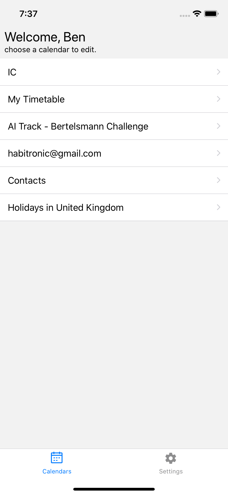
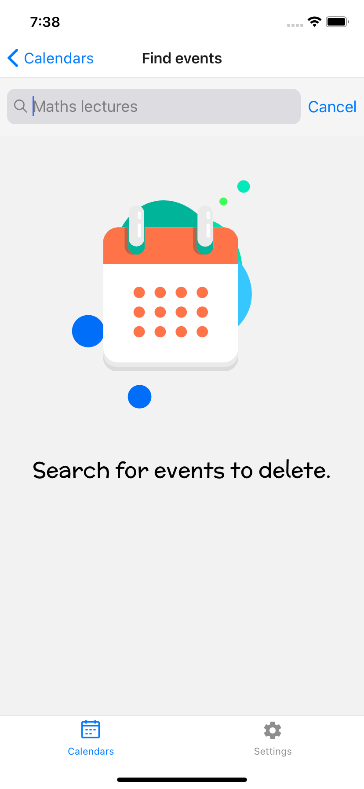
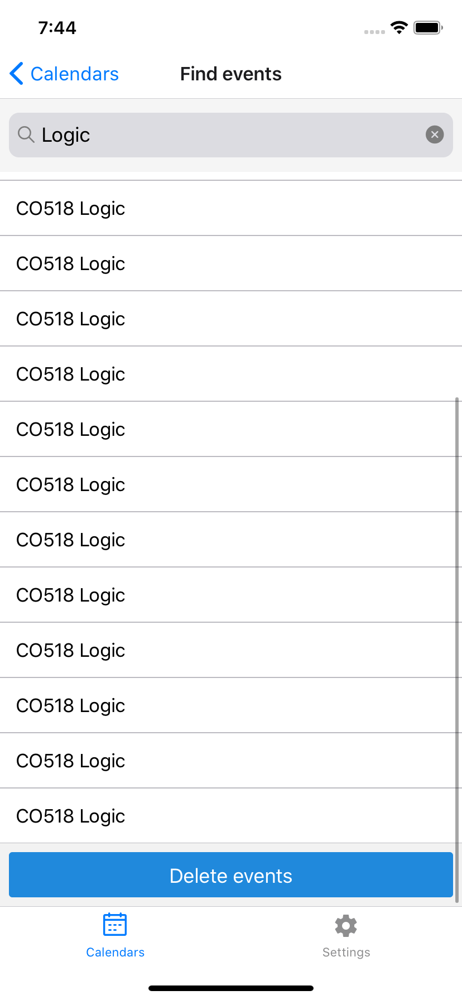
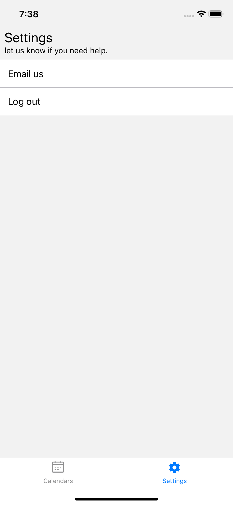

# BED: Bulk event deleter for Google Calendar. Log in, search for events you don't like, and delete them all. 

## Screenshots

  
  
  
  
  

## Use cases:
- Accidentally added many similar events to the wrong calendar
- Added a bunch of events, only a few of which you care about (e.g. university lectures :poop:)

## Releasing to devices:
- Plug device in
- Choose deviceId from `avd devices`
- Set HARDWARE_DEVICE_ID env to emulator id

## TODOs
- Fix typescript warnings
- Add tests
- Add network error modal [netinfo](https://github.com/react-native-community/react-native-netinfo)
- Add toast: permission issues (deleting read-only events)
- Difference between eslint and some other linter that im using
- Refactor AxiosInstance into module
